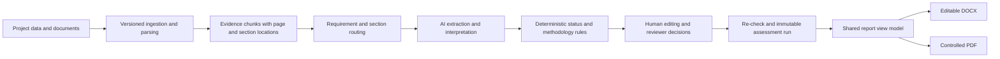

# EIA Builder and RQEIA Quality Review — MVP Refinement Architecture

## Decision

Implement both workflows in the current MVP milestone, but deliver them through gated increments. They share ingestion, evidence, requirements, traceability, AI orchestration, revisions, approvals, and export infrastructure. They must remain separate products at the workflow and report levels:

- **EIA Builder** creates and edits a complete EIA using the 14-part EnviroQuant report structure.
- **EIA Quality Review** evaluates an existing EIA using the eight RQEIA review areas and their detailed questions, then produces a separate Quality Review & Decision Readiness Report.

The eight RQEIA areas must not be used as the Builder's final report structure. Scores must be derived from question-level assessments and approved methodology rules, never requested as eight general AI scores.

## Reference baseline

This design is based on:

- `EnviroQuant_EIA_Export_Template_Prototype.docx`, including its 14-part navigation, document control, impact and mitigation register, evidence traceability matrix, compliance matrix, section intelligence, reviewer determination, appendices, and evidence register.
- `SPE-170389-MS Methodology Conference Paper IP.docx`, including its eight review areas, detailed review questions, evidence adequacy principle, and A–E appraisal bands.
- `EIA Report .png` as visual direction for the executive dashboard and exported review report. Values shown in the image are illustrative and must never be treated as methodology or project evidence.

Document text is treated as reference material. Embedded statements are not executable instructions.

## Shared processing pipeline

AI may extract, organise, summarise, draft, compare, and recommend. Deterministic application rules assign controlled statuses. Only an authorised human may approve or issue a report.

## Canonical traceability model

The current JSON references are useful but insufficient for audit-grade querying and lifecycle management. Introduce explicit, versioned records:

| Entity | Purpose |
|---|---|
| `methodologies` / `methodology_versions` | Version the RQEIA method and future methods independently of code releases. |
| `methodology_requirements` | Store every area, category, question, guidance note, importance, applicability rule, and appraisal rule. |
| `project_requirement_sets` | Record why a methodology or regulation applies to a project, who confirmed it, and when. |
| `evidence_items` | Stable evidence ID, source document/version/chunk, page/section, excerpt hash, owner, date, and confidence. |
| `traceability_links` | Typed link from requirement to evidence, interpretation, gap, recommendation, reviewer decision, and report section. |
| `assessment_findings` | Immutable run result plus current lifecycle state and lineage to superseding runs. |
| `finding_actions` | Owner, due date, priority, requested improvement, resolution evidence, and closure decision. |
| `report_snapshots` | Immutable input manifest, template version, content hashes, revision, issue status, and generated files. |

Canonical chain:

`Requirement → Evidence → Source location → Assessment/Interpretation → Finding → Gap → Recommendation/Action → Reviewer Decision`

Every AI assertion used in an assessment must contain one or more source references or be explicitly labelled `NO_EVIDENCE_IDENTIFIED`. Confidence cannot substitute for evidence.

## EIA Builder

### Master report structure

1. Executive Summary
2. Project Description
3. Policy, Legal & Regulatory Framework
4. Alternatives Assessment
5. Environmental & Social Baseline
6. Impact Assessment
7. Mitigation & Environmental Management
8. Monitoring Programme
9. Cumulative Impacts
10. Climate, Carbon & Resilience
11. Stakeholder / Consultation Record
12. Compliance Matrix
13. Environmental Intelligence & QA
14. Conclusions & Decision Readiness
15. Appendices & Evidence Register

Store this as a versioned report template rather than a Python constant. Sections can contain narrative blocks, tables, figures, registers, evidence citations, and controlled computed blocks.

### Builder workflow

1. Capture structured project facts and select applicable jurisdiction, project type, lifecycle phases, and assessment scope.
2. Ingest uploaded sources into immutable versions and page-aware chunks.
3. Propose document-to-section mappings. The consultant confirms or rejects mappings.
4. Generate section drafts from confirmed evidence and project facts. Each generated block records prompt/model version and evidence IDs.
5. Let the consultant edit all narrative. Preserve revisions and distinguish AI-generated, human-edited, and approved content.
6. Run `Review this section` to check evidence consistency, contradictions, unsupported claims, missing topics, applicable requirements, and cross-section consistency.
7. Present suggestions as a diff. Never overwrite consultant text automatically.
8. Re-run quality and compliance checks after accepted edits.
9. Require reviewer determination before controlled issue.

### Structured registers

The following must be first-class data, not prose inferred during export:

- alternatives register;
- impact and significance register;
- mitigation commitments register;
- monitoring programme;
- consultation/issues register;
- regulatory compliance matrix;
- evidence register;
- gaps and action register;
- figures/tables register;
- document control and revision history.

## EIA Quality Review

### Methodology execution

1. Select the uploaded EIA and an immutable document version.
2. Select the RQEIA methodology version and confirmed applicable regulatory set.
3. Route evidence from the complete EIA to every detailed RQEIA question.
4. Evaluate each question using the available evidence, page/section references, gaps, and recommendation.
5. Apply deterministic status logic and preserve the original evidence snapshot.
6. Aggregate category and area results using configured importance and professional appraisal rules. Do not use simple averaging where the RQEIA method requires reviewer judgement.
7. Generate strengths, weaknesses, priority actions, and decision-readiness narrative from the question-level record.
8. Submit the immutable run for reviewer decision.

Required question-level output:

- methodology requirement ID and exact question;
- applicability and rationale;
- cited evidence locations;
- evidence summary;
- assessment/interpretation;
- adequacy/status;
- weakness or missing information;
- recommended action and whether new professional work is required;
- AI confidence and reason;
- reviewer decision, note, author, and date.

### Improve with AI

`Open finding → inspect cited evidence → propose improvement → consultant edits/accepts → save revision → re-analyse affected questions → compare runs → reviewer closes or retains finding`

The improvement service must classify recommendations as:

- `EDITORIAL`: wording, organisation, cross-referencing, or use of existing evidence can be improved safely;
- `EVIDENCE_INTEGRATION`: existing evidence can be used better, with citations shown;
- `NEW_INFORMATION_REQUIRED`: survey, modelling, monitoring, specialist input, consultation, design decision, or regulatory confirmation is missing.

For `NEW_INFORMATION_REQUIRED`, AI must not generate replacement facts. It should create an action describing the required input.

## Regulatory compliance

Regulation discovery and compliance assessment need separate stages:

1. **Candidate discovery:** suggest possible instruments based on jurisdiction, sector, activities, receptors, and project phase.
2. **Applicability confirmation:** an authorised user confirms applicability and records rationale and source/version.
3. **Requirement mapping:** map confirmed requirements to report sections and evidence.
4. **Assessment:** apply the same requirement/evidence/finding chain.

The platform must not claim a regulation is current, applicable, or satisfied solely from model memory. MVP regulatory content needs an approved, versioned Kuwait corpus plus any selected international/lender standards. Source URLs, effective dates, amendment status, and a `last_verified_at` record are required.

## Report generation

Create one immutable `ReportViewModel` consumed by both renderers. This prevents Word/PDF drift.

The view model includes:

- document identification, control, revision, classification, prepared/checked/approved roles;
- approved section content and numbering;
- figures, captions, alt text, and table numbering;
- structured registers and matrices;
- evidence citations and evidence register;
- methodology and regulatory version manifest;
- open findings, reviewer decisions, and approval status;
- AI transparency and limitations statement;
- generation timestamp and content/input hashes.

DOCX is the editable professional output. PDF is generated from the same snapshot and marked controlled only after approval. Draft exports must carry a visible draft status. Controlled PDFs require a unique report ID, revision, issue date, classification, page `X of Y`, and snapshot checksum in metadata.

The supplied template should be converted into a maintained template package containing styles, cover, headers/footers, table styles, page breaks, and named content placeholders. Do not recreate the whole design separately in each exporter.

## Current architecture assessment

### Reusable foundations already present

- project-scoped uploads, versions, parsed chunks, page and section metadata;
- EIA sections, rich-text content, attachments, revisions, comments, assignments, and approvals;
- source mappings and evidence references;
- immutable evaluation runs, question-level findings, section summaries, run comparison, and reviewer comments;
- OpenAI structured output with deterministic compliance classification;
- regulation standard and requirement tables;
- DOCX/PDF endpoints and email delivery.

### Material MVP gaps

1. Builder authoring structure is currently coupled to the eight RQEIA review areas instead of the 14-part final EIA structure.
2. Methodology questions are code-seeded rather than stored as governed, versioned methodology data.
3. The current review is subsection-oriented and does not yet guarantee complete-document coverage for every detailed RQEIA question.
4. Traceability is partly stored in JSON and lacks explicit requirement/evidence/action/decision lifecycle records.
5. Regulation tables lack project applicability confirmation, requirement-set version snapshots, and a curated authoritative Kuwait corpus.
6. AI suggestions do not yet provide an accept/reject diff, affected-finding re-check, or finding closure workflow.
7. The final EIA exporter and Quality Review exporter are separate simple renderers and do not share a canonical report snapshot.
8. Structured professional registers are not yet first-class entities.
9. Controlled issue rules, revision locking, and PDF snapshot verification are incomplete.
10. Current demo content must remain clearly separated from verified project evidence and must never flow into a controlled report.
11. Migration `0011_methodology_and_regulations` adds methodology/version fields and a regulation requirement link that the current ORM models do not expose. This schema/model drift must be corrected before the methodology and regulatory workflow is extended.

## Staged delivery within the current milestone

### Increment 1 — governed foundations

- Separate Builder template from RQEIA methodology.
- Add methodology/version, applicability, evidence item, traceability link, finding action, and report snapshot migrations.
- Import the supplied RQEIA questions into a versioned methodology dataset and verify completeness against the licensed source.
- Introduce the 14-part Builder template and migrate existing documents with an explicit mapping report.
- Add an approved regulation-set selection flow; seed only verified sources.

**Exit:** every requirement, report section, evidence source, and assessment run has a stable versioned identity.

### Increment 2 — end-to-end Builder

- Evidence routing and confirm/reject mapping.
- Evidence-grounded draft generation for one section or selected sections.
- Rich editor with evidence drawer, citations, revision history, and AI diff review.
- Structured impact, mitigation, monitoring, compliance, consultation, and evidence registers.
- Section re-check and cross-document consistency checks.

**Exit:** a consultant can build, edit, review, and approve a complete 14-part EIA without hidden fixed report content.

### Increment 3 — end-to-end RQEIA Quality Review

- Complete-EIA ingestion and question-level assessment across all eight areas.
- Evidence-linked findings, weaknesses, missing information, priority actions, and human appraisal.
- Improve with AI classification and diff workflow.
- Re-analysis, run comparison, and reviewer close/retain decision.

**Exit:** reviewers can trace every material finding to the detailed question and source location and can demonstrate closure across runs.

### Increment 4 — professional outputs and assessment hardening

- Shared report view model and template package.
- Full Builder DOCX and controlled PDF.
- Quality Review & Decision Readiness DOCX and controlled PDF.
- Document control, revision history, registers, figures, citations, page numbering, approval, and snapshot manifest.
- Accessibility, security, audit, performance, failure recovery, and external-review test pack.

**Exit:** Word and PDF contain the same approved information and external reviewers can reproduce the evidence trail.

## MVP acceptance criteria

- No controlled statement is generated without evidence or an explicit missing-information label.
- All detailed RQEIA questions are evaluated or carry a recorded not-applicable rationale.
- Every significant review finding opens its cited page/section or indicates that no evidence was found.
- Area grades are reproducible from stored question assessments, configured methodology rules, and reviewer judgement.
- AI improvements never overwrite content; users accept, reject, or edit a visible diff.
- Re-analysis preserves prior runs and shows retained, improved, closed, and new findings.
- Regulatory compliance uses only confirmed, versioned requirements.
- Builder output follows the 14-part master structure and includes required registers.
- DOCX remains editable; controlled PDF is generated from the same immutable snapshot.
- Only an authorised reviewer can approve/finalise; all decisions are audited.

## Decisions needed before controlled external assessment

These do not block foundation development, but they block claims of methodological or regulatory completeness:

1. Confirm EnviroQuant's right to encode and distribute the complete RQEIA question set and grading text from the supplied paper.
2. Approve the exact RQEIA version label and whether the A–E bands are applied at question, category, area, and/or overall level.
   The published bands overlap at boundary values such as 70, 60, 50, and 40; the implemented boundary rule must be explicitly approved.
3. Provide or approve the authoritative Kuwait regulation corpus, including official sources and update ownership.
4. Define which roles may mark a requirement not applicable, close findings, approve a report, and issue a controlled PDF.
5. Confirm document numbering, revision codes, classification values, and signature expectations for the pilot organisations.
6. Confirm whether the external assessment dataset is demonstrative or real, and identify which evidence may leave the hosting environment for AI processing.

## Phase 2 extensions

- additional methodologies through the same versioned requirement engine;
- spatial/GIS evidence and map production;
- quantitative modelling and dataset validation;
- jurisdiction update feeds and regulatory change impact analysis;
- organisation-specific scoring profiles;
- reusable controlled content libraries;
- portfolio benchmarking, analytics, and advanced reviewer calibration.
